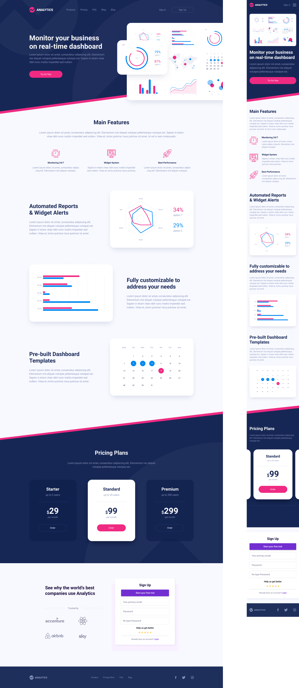

# $\color{lightblue}\text{ANALYTICS}$

$\color{limegreen}\text{Учебная работа}$

### $\color{mediumblue}\text{Описание работы }$:

✅ Внешняя часть главной страницы сайта бизнес аналитики.

✅ Итоговая аттестация для программ IT-специалиста «Верстка» ( _GeekBrains_ ).

---

Макет -> [**Figma**](<https://www.figma.com/design/PxV85sdIzWj0CZ2kqg0hsT/Analytics-%E2%80%94-Landing-Page-Design-(Community)?node-id=0-1&t=JakwUkG3YKKjNfzN-0>)

Вёрстка -> [**Git pages**](https://artiom-work.github.io/analytics/)

---

### $\color{mediumblue}\text{Цели и задачи работы :}$

⏱ На работу выделяется 24 часа.

**$\color{mediumblue}\text{В соответствии с макетом необходимо :}$**

❗ Добавить все блоки по сайту (Использовать семантическую структуру).

❗ Добавить все наполнение блоков (html контент).

❗ Все заголовки, параграфы кнопки и изображения.

❗ Ко всем элементам контента добавить классы.

❗ Подключить стили к index.html.

❗ Добавить обнуление стилей.

❗ Добавить все необходимые отступы margin, padding.

❗ Для всех html элементов необходимо задать стили в соответствии с макетом.

❗ Расставить все элементы в соответствии с макетом.

❗Добавить стили для всего контента сайта.

❗Расставить элементы в соответствии с макетом.

❗Добавляем эффекты наведения, где это необходимо.

❗Реализовать:

    	Если пользователь вводит в поле повторить пароль значение, которое не совпадает с первым значением, необходимо подсветить оба поля ввода красной рамкой, если значения совпадают, сделать подсветку зеленой рамкой.

❗В макете представлен рейтинг 5 звёзд, его пользователь сам должен выбрать,нужно добавить функционал, чтобы пользователь мог отметить на сколько он оценивает сайт.

🎯 Основная задача - Улучшение базовых навыков вёрстки.

### $\color{mediumblue}\text{Технологии, инструменты и способы вёрстки :}$

📌 БЭМ
📌 Семантика
📌 Адаптивная вёрстка
📌 Flex
📌 Grid
📌 Figma
📌 VScode
📌 Git

---
